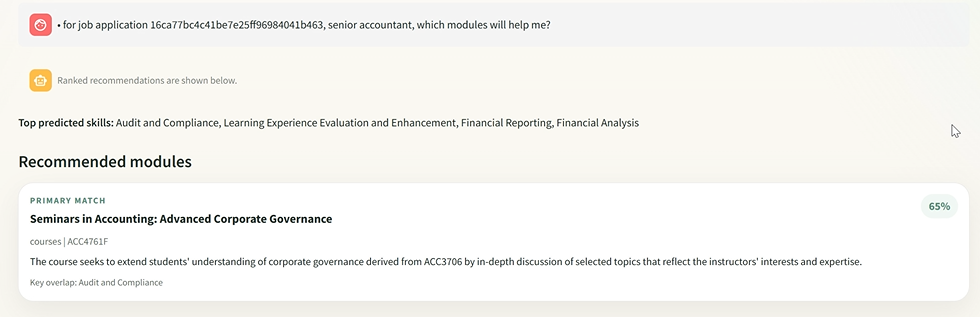
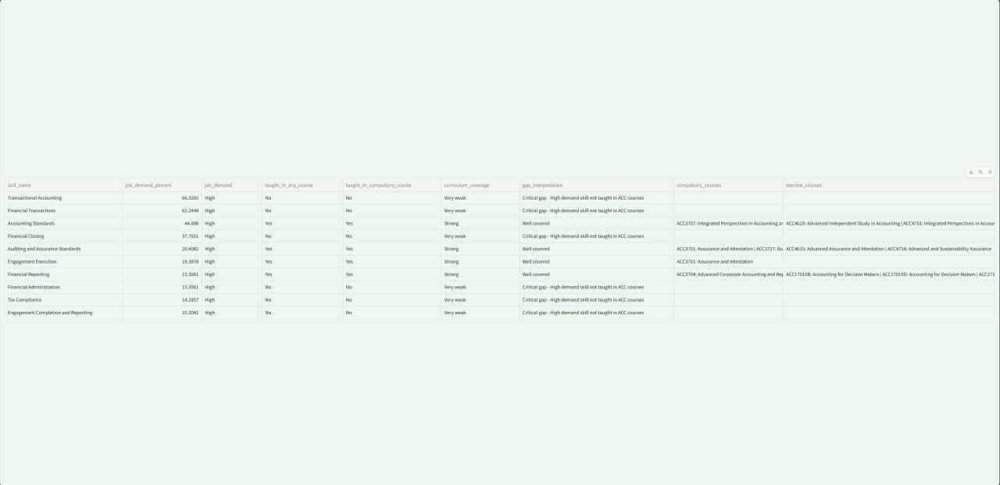

# A Data-Driven Framework for Identifying Curriculum–Industry Skill Gaps

By Alvis Low Yue Han, Lam Jian Yi Eugene, Lee Tze Ning, Ryan Toh Jun Hui, Yap Yi Pin

## Section 1: Context

Are the university courses equipping students with the skills employers demand? Recent Graduate Employment Survey results highlight this issue, with the proportion of fresh graduates securing employment within six months declining from 94.5% in 2021 to 87.1% in 2024\. This trend also affects fresh graduates across various studies. While macroeconomic factors such as economic slowdown and the rapid advancement of artificial intelligence (AI) may reduce or reshape entry-level opportunities, industry feedback highlights a more actionable issue: skills mismatch between university training and employers’ expectations. 

The Ministry of Education (MOE) is responsible for ensuring university education remains relevant in the workplace including digital literacy, core competencies, and technical skills. Therefore, MOE must **assess whether current university curricula are aligned with employer skill requirements for “good jobs”,** defined as entry-level roles relevant to a graduate’s field of study. **If misalignment exists, the MOE should identify the specific skills that are not being adequately developed.**

However, MOE currently lacks a granular, data-driven mechanism to systematically evaluate this alignment. This limitation creates a significant informational blind spot for the Higher Education Planning Office (HEPO) and the Higher Education Policy Division (HEPD) to generate effective policy decisions.

To address this challenge, our team developed a data-driven approach, outlined in the following sections.

## Section 2: Scope

### 2.1 Problem

The HEPD within MOE is responsible for ensuring that university curricula remain relevant to labour-market needs. Policy officers compare university courses’ learning outcomes with current employer demands reflected in job postings, typically during periodic curriculum and policy review cycles. The process is currently highly manual and requires officers to review large volumes of unstructured text across both academic and labour-market sources.

To demonstrate the substantial scale, National University of Singapore (NUS) alone offers 60 majors, 54 second majors, and more than 80 minors, each with multiple course descriptions. Furthermore, Singapore has 6 autonomous universities (AU). In addition, Singapore recorded an annual average of approximately 75,900 job vacancies in 2025, each containing descriptions of required skills and responsibilities.

Consequently, curriculum-relevance assessments are slow, labour-intensive, and difficult to perform consistently. Officers must manually review jobs advertisements for emerging skills and compare them against course descriptions and learning outcomes. Furthermore, the labour market changes continuously, especially with AI and digital adoption across industries, such reviews quickly become outdated. This Ministry may rely on lagging signals when evaluating whether university offerings remain aligned with employer needs.

This inability to efficiently track curriculum alignment creates a significant operational bottleneck within the Ministry. Policy officers from HEPO and HEPD are diverted from strategic policy work and are instead occupied with manual data compilation. As a result, human capital is largely misallocated, generating hidden administrative costs, and reducing overall efficiency.

This oversight gap is even more critical, with students investing years into degrees that may lack the specific skillsets employers are looking for, contributing to the lower employment rate highlighted in the previous section. Ultimately, this mismatch can lead to delayed career progression, increased unemployment, and diminished wellbeing for graduates, while simultaneously burdening employers with higher onboarding costs and creating a cohort-level drag on Singapore's economic productivity.

Data science and machine learning are more suitable than manual review because the Ministry’s task involves interpreting large amounts of **unstructured text**. In job postings and course descriptions, the same skill can be expressed in many different ways, and embedded within full sentences instead of being listed as standard keywords. A purely manual or rule-based approach is slow, difficult to scale, and therefore inconsistent.

In contrast, Natural Language Processing (NLP) models identify skill-related phrases from raw text and use semantic similarity to match them to entries in a standardized skills taxonomy even when the wording differs. This can be developed into an automated pipeline that continuously processes new job postings, identifies emerging skills, and compares them against the university courses’ learning outcomes. This allows the Ministry to move from periodic manual reviews to a more timely and proactive system.

### 2.2 Success Criteria

If this project is successful, it should achieve two key goals for MOE.

**Operational Goal:**

Create a system that can process new data and reduce the time required for course-to-job skill mapping by at least 75% compared with the current manual review process. This can be evaluated through User Acceptance Testing (UAT) by comparing the time taken for officers to complete the same review task manually versus with the system.

**Business Goal:**

Enable policy officers to identify curriculum gaps and emerging skill demands in a more timely and convenient manner by providing a user-friendly natural language interface for querying latest labour-market and course data. 

### 2.3 Assumptions

The project relies on several key assumptions. 

First, skills stated in job advertisements are genuine employer demand rather than aspirational preferences. 

Second, course descriptions and learning outcomes obtained from the NUSMods API accurately reflect current teaching content. 

Third, skills taxonomy is sufficiently up-to-date and comprehensive for mapping both job and course content. 

Fourth, there will be sufficient manpower with domain expertise to label the skills for jobs and courses that are currently available correctly, if implemented at scale. 

Finally, it assumes that HEPD will have the organizational willingness and authority to use the tool’s outputs in actual curriculum review processes.

## Section 3: Methodology

### 3.1 Technical Assumptions

Several key technical assumptions are made. 

First, MyCareersFuture job advertisements and NUS course descriptions contain sufficient textual detail for meaningful skill extraction and text embedding. 

Second, given limited time and manpower provided to this data science team, it is more feasible to prototype the model within a restricted domain, namely accountancy-, audit-, and tax-related roles and courses.

Third, restricting the prototype to a certain domain is justified because AI is rapidly changing the scope of work in these roles which makes skills-mismatch detection especially relevant. Recent industry sources indicate that AI is automating routine tasks in finance and accounting, while shifting human work toward judgment, interpretation, communication, and explaining insights to stakeholders. 

Finally, we assume these roles provide more policy-relevant prototype domains than occupations less affected by digital and AI-driven change, thereby giving management a clearer test of whether the broader project is worth scaling.

### 3.2 Data

#### 3.2.1 Data Collection

This project used four main data sources. 

1. **Job advertisement data** was collected from **MyCareersFuture** between **25 January 2026 and 31 January 2026** in raw JSON format.  
2. **NUS course data** (Academic Year 2025/26) was collected from the **NUSMods API**.   
3. Candidate **skills associated with jobs and courses** were obtained using the **Skills Extraction & Comparison Tool** from the **SkillsFuture Jobs-Skills Portal**, by supplying the corresponding job and course descriptions as input text.  
4. The **Skills taxonomy** used as the common reference framework was obtained from the **Frameworks** section of the **SkillsFuture Jobs-Skills Portal**.

#### 3.2.2 Data Cleaning and Filtering

For the job advertisements, the raw text was cleaned by removing HTML tags, decoding HTML entities, correcting broken characters where possible, normalizing whitespace, and removing emojis.

The **jobs dataset** was then filtered to match the intended project scope. Specifically, only roles suitable for **fresh graduates or candidates with a few years of experience** were retained. This was done by filtering for postings containing indicators such as *“fresh/entry-level”* or *“Junior Executive”*, references to degree qualifications such as *“degree”* or *“bachelor’s”*, and roles requiring **fewer than four years of experience**. The dataset was then further narrowed to **accountancy-, audit-, and tax-related roles**.

For the **course dataset**, only courses with codes beginning with **ACC** were retained, as these corresponded to accounting-related undergraduate modules. Following that, courses at **level 5000 and above were excluded**, because these are postgraduate-level modules that fall outside the project scope. Amongst the courses left, two of them with **descriptions under 20 words were removed** because their descriptions were too brief to support meaningful skill extraction.

For the **skills taxonomy**, only skills belonging to the **Accountancy** and **Financial Services** sectors were retained in order to align the skills space with the selected project domain.

As the project primarily involved textual data rather than numerical variables, traditional outlier treatment was not a major concern. After applying the project scope filters, the final dataset consisted of **98 job advertisements**, **64 courses**, and **229 skills**.

#### 3.2.3 Feature Engineering

Each **job description** and **course description** were converted into dense vector representations using the **ZeroEntropy-1 embedding model**. This transformed unstructured text into numerical embeddings that could be compared within a shared semantic space, so that it could be used to infer which skills were most relevant to a given job or course, even when the wording was not exactly identical.

In addition, the **extracted skills for both jobs and courses were manually reviewed and edited** against the standardized SkillsFuture taxonomy. This step was performed to improve consistency, remove obvious extraction errors, and create a cleaner labelled dataset for downstream evaluation.

#### 3.2.4 Data Splitting

The labelled dataset was split into **training, validation, and test sets** using a **3:1:1 ratio**. Jobs and courses were split separately.

The training set was used for model development, the validation set was used for intermediate tuning, threshold and model selection, and the test set was reserved for final evaluation. 

### 3.3 Experimental Design

The experiments in this project formulate the task as a **multi-label skill prediction problem**. Each input consists of an embedded **job** or **course description**, and the model outputs one or more relevant skills from the filtered set of **229 skills**. The predicted skills act as an intermediate representation for linking job requirements to relevant university courses.

We selected two prediction approaches that are suitable for fast prototyping: **cosine similarity** and **one-vs-rest (OvR) logistic regression** . Both approaches used the same text embedding to ensure a fair comparison.

The **cosine similarity** approach serves as a simple retrieval-based baseline. It measures the semantic similarity between each job or course embedding and each skill embedding in a shared vector space. Skills with higher cosine similarity scores are considered more relevant to the given entity. This method was chosen because it is computationally simple, does not require extensive supervised training, and is a natural baseline for an embedding-based matching problem.

The **OvR** **logistic regression** approach serves as a supervised comparison model. One binary classifier is trained for each skill to predict whether that skill is relevant to a given job or course, based on the same embedding features. This model was chosen because it is lightweight, and suitable for small datasets, while still allowing the model to learn per-skill decision boundaries that may outperform direct similarity ranking.

For both model families, we evaluated two prediction strategies: **threshold-based prediction** and **top-k prediction**. In threshold-based prediction, all skills with scores above a tuned threshold are assigned, allowing each record to receive a variable number of predicted skills. In top-k prediction, the model always returns the fixed number of highest-scoring skills. This design allows comparison not only between unsupervised and supervised modelling approaches, but also between two ways of generating multi-label outputs. Therefore, the main hyperparameters tuned were the threshold and the value of k.

Model performance was evaluated as a **multi-label classification task**, where each job or course may be associated with multiple valid skills. The reporting metrics were **micro-averaged** and **macro-averaged precision, recall, and F1-score**.

Among these metrics, **micro-F1** was used as the primary model selection criterion. This is because the task exhibits substantial **class imbalance** across the 229-skill label space, with some skills appearing much more frequently than others. In this setting, accuracy would not be appropriate, since the very large number of true negative entity-skill pairs could make performance appear artificially high even when relevant skills are missed. Precision and recall on their own were also insufficient. Optimising only precision would make the model too cautious and cause it to miss relevant skills, while optimising only recall would make it predict too many irrelevant skills. Micro-F1 was therefore used to balance both objectives. It was preferred over macro-F1 as the main tuning objective because the validation set was relatively small, making macro-averaged scores more unstable and sensitive to rare skills with very low support.

The final set of hyperparameters for each model variant was chosen by tuning on the **training set** and comparing the best-performing configuration on the **validation set**. Specifically, the best variant from each of the four experimental setups was evaluated on the validation set. The model with the highest **validation micro-F1** was selected as the final model for subsequent testing.

## Section 4: Findings

### 4.1 Results

Validation-set results (to 3sf):

| Model | Micro F1-score | Micro Precision | Micro Recall | Macro F1-score | Macro Precision | Macro Recall |
| :---- | :---- | :---- | :---- | :---- | :---- | :---- |
| OvR Logistic Regression (Threshold) | 0.694 | 0.704 | 0.685 | 0.0664 | 0.0662 | 0.0724 |
| OvR Logistic Regression (Top-K) | 0.699 | 0.654 | 0.750 | 0.0565 | 0.0529 | 0.0653 |
| Cosine Similarity (Threshold) | 0.302 | 0.194 | 0.685 | 0.0377 | 0.0299 | 0.0584 |
| Cosine Similarity (Top-K) | 0.276 | 0.191  | 0.500  | 0.0347 | 0.0389  | 0.0533  |

Choosing based on the best validation micro F1-score, our final model is OvR logistic regression (Top-K). This is its’ test-set results (3sf):

| Micro F1-score | Micro Precision | Micro Recall | Macro F1-score | Macro Precision | Macro Recall |
| :---- | :---- | :---- | :---- | :---- | :---- |
| 0.635 | 0.571 | 0.714 | 0.0424 | 0.0407 | 0.0523 |

The test-set micro F1-score of 0.635 was slightly lower than the validation score of 0.699, but the decrease was not large. This suggests that the model’s performance remained reasonably consistent on unseen data, indicating acceptable generalisation.

SHAP and LIME were not used for interpretability because the models relied on dense embedding features. Although these methods could technically be applied, the resulting explanations would describe the contribution of abstract embedding dimensions. Given that the intended users are policy officers who need actionable explanations, we instead used skill-level interpretability, which will be outlined in the **4.2 Discussions**. 

### 4.2 Discussions

The final model was applied to the full filtered accountancy jobs and courses dataset to generate a table showing which skills were most frequently demanded in job postings and whether those skills appeared to be covered by existing ACC courses. This output directly supports the project’s business objective of helping policymakers identify potential curriculum gaps more efficiently. The table could be found at the end of `model/ovr_logreg_topk.ipynb`.

Micro F1-score places greater weight on skills that appear more frequently in the dataset. This is meaningful in the present business context, because MOE is especially interested in identifying widely demanded skills that affect a large share of entry-level roles. Therefore, even if the model does not achieve perfect prediction across every skill, a reasonably strong micro F1-score suggests that it can still provide business value by surfacing the most important demand patterns for curriculum review. However, this also means that the model may be less reliable for rare or emerging skills, so its outputs should only be used as a decision support tool.

We also built a **prototype chatbot** on top of the final model. The chatbot currently runs locally to support the operational and business goals.

As shown in the screenshots, the chatbot can generate **interpretable course-skill-job matching outputs**. 

It also displays a **skills-gap table in the sidebar providing the latest labour-market and related course data** that can be expanded for further review. The user can then ask the chatbot if they want more information regarding the details.

### 4.3 Recommendations

Future work should focus on improving the project’s breadth, data pipeline, and deployability. 

#### 4.3.1 Project Breadth 
Extend the system beyond accounting-related modules and roles to cover other disciplines, other job families, and eventually courses from multiple universities in Singapore. Specifically, the Ministry could prioritise sectors undergoing rapid change in entry-level skill requirements, so that analysis is targeted at areas where curriculum gaps are most likely to appear. 

#### 4.3.2 Data pipeline 
The data pipeline should also be enhanced to ingest job advertisements on a continuous basis from multiple platforms. Additionally, it should retrieve the skills taxonomy updates from the SkillsFuture website and all AU’s course updates in real time or at regular automated intervals. This would enable the system to remain aligned with current labour-market demand, skills framework and courses’ details. 

Both sections 4.3.1 and 4.3.2 require extra coordination with the AUs, as they (except NUS) do not offer APIs that provide updated course lists and descriptions. Although web scraping is technically feasible, it is relatively brittle and labour-intensive. A more robust alternative would be for the Ministry to request that each AU periodically submit course-level skill mappings based on the standardized skills taxonomy. Besides reducing technical fragility, this would also improve data quality by reducing reliance on course descriptions alone, which may sometimes be too vague.

#### 4.3.3 Deployment
Finally, the chatbot should be further refined with better functionalities, stronger guardrails and deployed in a secure production setting so that policy officers can use it conveniently and confidently for their curriculum review workflow.

